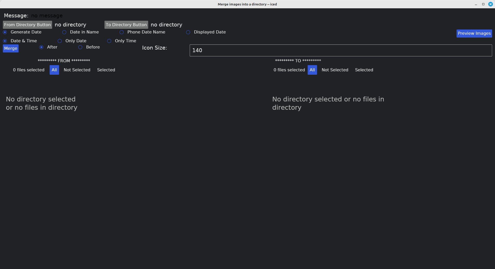

# MergeInto
Rust-Iced program that merges images into another folder.
I converted one function in photoomc04 from using gtk4 to iced.
Iced is still being developed so code may change over time.
Merges images into another directory one by one.

